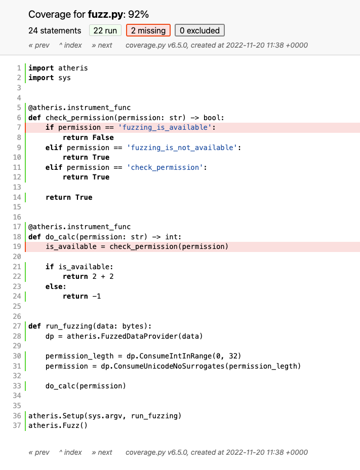
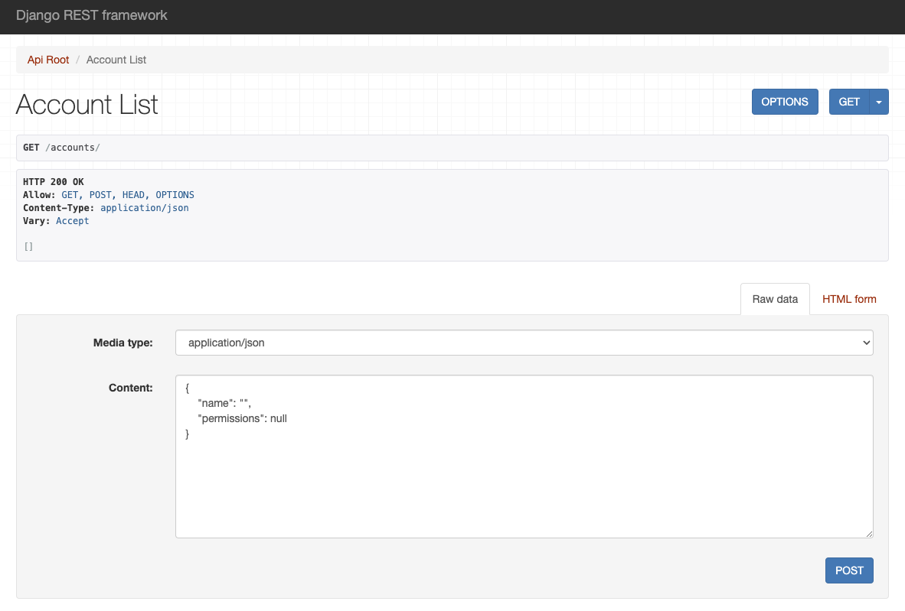
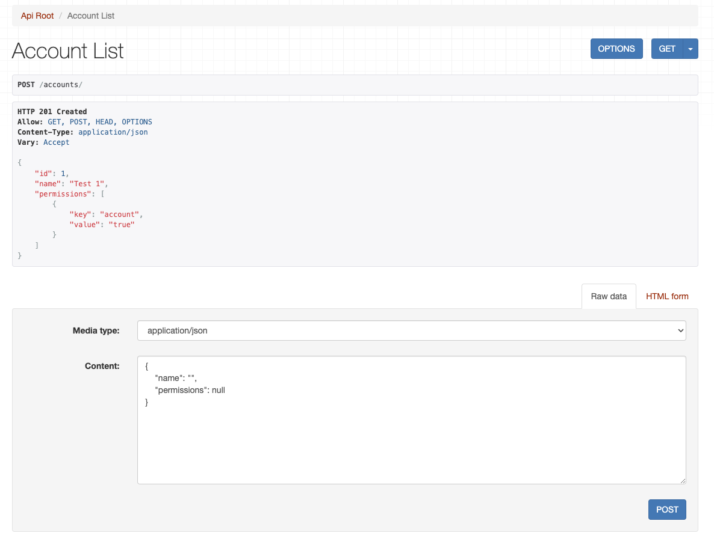
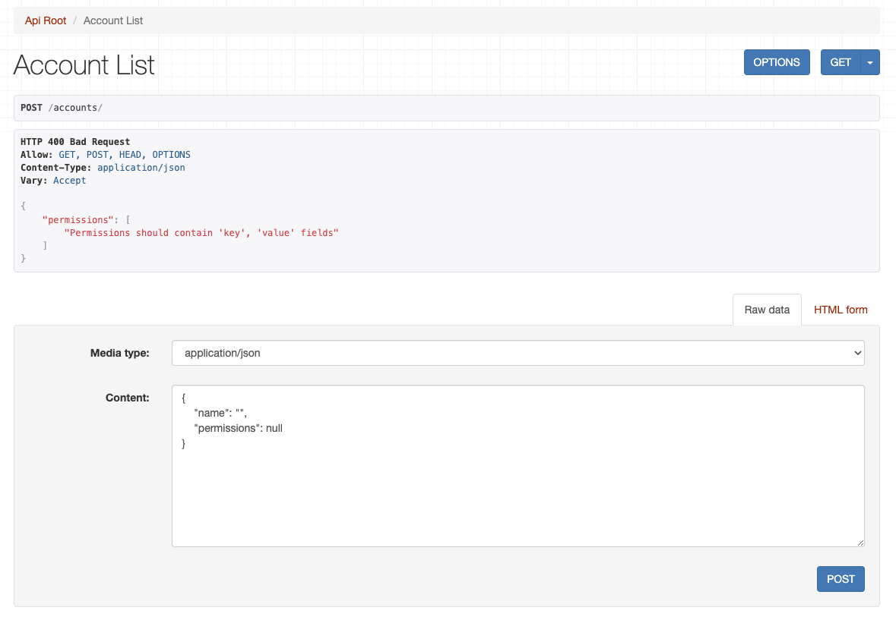
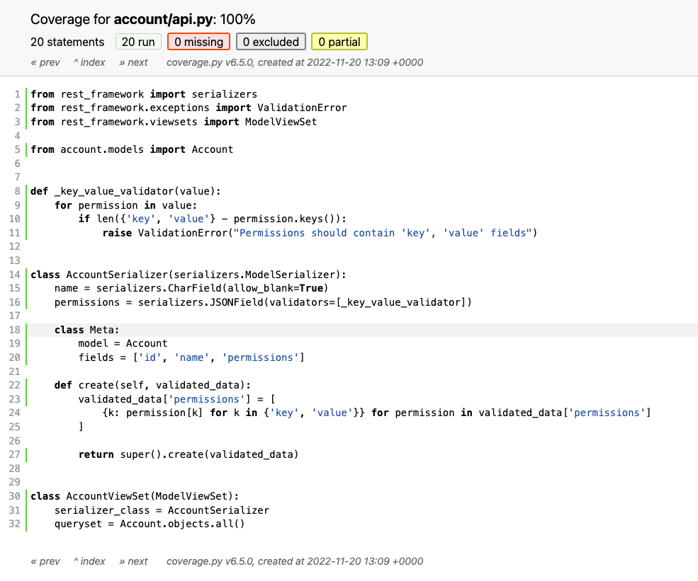

# PyDay BCN 2022 Workshop "Friendly fuzzing for your Python SaaS applications" step-by-step instruction

## Page Content
- [Prerequisites](#prerequisites)
- [Let's fuzz a simple example!](#lets-fuzz-a-simple-example)
- [Let's fuzz the Django REST Framework!](#lets-fuzz-the-django-rest-framework)

## Prerequisites
For the following workshop be sure, that
1. You have access to the internet :-)
1. *Docker* and *Docker Compose* are installed on your laptop
1. Prebuild all needed docker images
    1. Go to the directory `fuzz-simple-example` and run the build command for `fuzz` service
        ```
        > cd fuzz-simple-example && docker-compose build fuzz
        ```
    1. Go to the directory of the second example and run the build command for `fuzz` service
        ```
        > cd ../fuzz-drf-example && docker-compose build fuzz
        ```

## Let's fuzz a simple example!

Let's start with the simple example of fuzzing using *Atheris* library. Open the source code and go to the folder `fuzz-simple-example`
```
> cd fuzz-simple-example
```

Our fuzzing and fuzzed code are in the same file `fuzz.py`. Open it in your most loved editor and let's write the code for the fuzzer there

1. Before writing any code for the fuzzer you need to specify for *Atheris* what code it should track. Since *Atheris* use Code Coverage Feedback to track the quality and mutate the input data you should instrument the code, that you are going to fuzz. Here you have two functions `check_permission` and `do_calc`. The `do_calc` function is an interface function, that you are going to fuzz. Let's allow *Atheris* to instrument these functions. Put the `@atheris.instrument_func` decorator on them.
    ```
    @atheris.instrument_func
    def check_permission(permission: str) -> bool:
        if permission == 'fuzzing_is_available':
            return False
        ...

    @atheris.instrument_func
    def do_calc(permission):
        is_available = check_permission(permission)
        ...
    ```

1. Now let's write the code to run fuzzing. We have an empty function `run_fuzzing`. Here you'll write the fuzzer code. To allow *Atheris* to generate new input data and run `run_fuzzing` function you should set up and run *Atheris* fuzzing. Add this code to the bottom
    ```
    def run_fuzzing(data: bytes):
        pass

    atheris.Setup(sys.argv, run_fuzzing)
    atheris.Fuzz()
    ```

1. Let's run and check what you have now
    ```
    > docker-compose build fuzz
    > docker-compose run --service-ports fuzz
    ```

    The output of the command:
    ```
    > docker-compose run --service-ports fuzz
    INFO: Using built-in libfuzzer
    WARNING: Failed to find function "__sanitizer_acquire_crash_state".
    WARNING: Failed to find function "__sanitizer_print_stack_trace".
    WARNING: Failed to find function "__sanitizer_set_death_callback".
    INFO: Running with entropic power schedule (0xFF, 100).
    INFO: Seed: 2065693616
    INFO: -max_len is not provided; libFuzzer will not generate inputs larger than 4096 bytes
    INFO: A corpus is not provided, starting from an empty corpus
    #2  INITED exec/s: 0 rss: 34Mb
    WARNING: no interesting inputs were found so far. Is the code instrumented for coverage?
    This may also happen if the target rejected all inputs we tried so far
    Done 100000 in 0 second(s)
    ```

    Well, you see that *Atheris* found nothing interesting. And that's true - you don't run the instrumented functions! Let's do it!

1. To run the fuzzed functions with data you have to generate the samples of data. Yes, you have mutated bytes as `data` parameter in `run_fuzzing` function. But it is just bytes. And to make fuzzing effective you need to generate something meaningful to your `do_calc` function. Function `do_calc` has a string as an input. So let's generate a sample string from the input mutated bytes. To do it *Atheris* provides the special `FuzzedDataProvider` object. It has a lot of built-in methods to generate ints, strings, and bools from the provided amount of bytes. Let's define it inside the `run_fuzzing` function
    ```
    def run_fuzzin(data: bytes):
        dp = atheris.FuzzedDataProvider(data)
        ...
    ```

1. Now let's generate the Unicode string for the input of the `do_calc` function
    ```
     def run_fuzzin(data: bytes):
        dp = atheris.FuzzedDataProvider(data)
        permission = dp.ConsumeUnicodeNoSurrogates(???)
    ```

1. `ConsumeUnicodeNoSurrogates` has a string length as an input parameter. What length you should provide there? Good question... Well, let's also make it chosen by *Atheris*
    ```
    def run_fuzzin(data: bytes):
        dp = atheris.FuzzedDataProvider(data)

        permission_legth = dp.ConsumeIntInRange(0, 32)
        permission = dp.ConsumeUnicodeNoSurrogates(permission_legth)
    ```

    The number of bytes does not guarantee that the final Unicode will contain the exact number. It guarantees that it will be no more than provided number

1. And final step - invoke the `do_calc` function
    ```
    def run_fuzzin(data: bytes):
        dp = atheris.FuzzedDataProvider(data)

        permission_legth = dp.ConsumeIntInRange(0, 32)
        permission = dp.ConsumeUnicodeNoSurrogates(permission_legth)

        do_calc(permission)
    ```

1. Let's run it again!
    ```
    > docker-compose build fuzz
    > docker-compose run --service-ports fuzz
    ```

    The output of the command
    ```
    > docker-compose run --service-ports fuzz
    INFO: Using built-in libfuzzer
    WARNING: Failed to find function "__sanitizer_acquire_crash_state".
    WARNING: Failed to find function "__sanitizer_print_stack_trace".
    WARNING: Failed to find function "__sanitizer_set_death_callback".
    INFO: Running with entropic power schedule (0xFF, 100).
    INFO: Seed: 258538736
    INFO: -max_len is not provided; libFuzzer will not generate inputs larger than 4096 bytes
    INFO: A corpus is not provided, starting from an empty corpus
    #2  INITED cov: 5 ft: 5 corp: 1/1b exec/s: 0 rss: 34Mb
    Done 100000 in 0 second(s)
    ```

1. Perfect! It works. But what are the results of the fuzzing? Can it find some errors in the code? The answer is - yes! Let's emulate that you have an unhandled exception in your code. To do it - modify the `elif permission == 'check_permission':` branch in function `check_permission` to raise the exception
    ```
    @atheris.instrument_func
    def check_permission(permission: str) -> bool:
        ...
        elif permission == 'check_permission':
            raise RuntimeError('Fuzzing!!!')
        ...
    ```

1. And run it again
    ```
    > docker-compose build fuzz
    > docker-compose run --service-ports fuzz
    ```

    And it automatically found the unhandled exception in the code!
    ```
    > docker-compose run --service-ports fuzz
    INFO: Using built-in libfuzzer
    WARNING: Failed to find function "__sanitizer_acquire_crash_state".
    WARNING: Failed to find function "__sanitizer_print_stack_trace".
    WARNING: Failed to find function "__sanitizer_set_death_callback".
    INFO: Running with entropic power schedule (0xFF, 100).
    INFO: Seed: 3549309748
    INFO: -max_len is not provided; libFuzzer will not generate inputs larger than 4096 bytes
    INFO: A corpus is not provided, starting from an empty corpus
    #2  INITED cov: 5 ft: 5 corp: 1/1b exec/s: 0 rss: 34Mb

     === Uncaught Python exception: ===
    RuntimeError: Fuzzing!!!
    Traceback (most recent call last):
      File "/app/fuzz.py", line 33, in run_fuzzing
        do_calc(permission)
      File "/app/fuzz.py", line 21, in do_calc
        if is_available:
      File "/app/fuzz.py", line 14, in check_permission
        return True
    RuntimeError: Fuzzing!!!

    ==1== ERROR: libFuzzer: fuzz target exited
    SUMMARY: libFuzzer: fuzz target exited
    MS: 3 ChangeByte-CopyPart-CMP- DE: "check_permission"-; base unit: adc83b19e793491b1c6ea0fd8b46cd9f32e592fc
    0x3b,0x63,0x68,0x65,0x63,0x6b,0x5f,0x70,0x65,0x72,0x6d,0x69,0x73,0x73,0x69,0x6f,0x6e,0x3b,
    ;check_permission;
    artifact_prefix='./'; Test unit written to ./crash-33a93877f7e7f5296e97381eb36e5f59e6094003
    Base64: O2NoZWNrX3Blcm1pc3Npb247
    ```

1. Also you can track the coverage during the *Atheris* execution. Return the code with an exception in the `check_permission` function
    ```
    @atheris.instrument_func
    def check_permission(permission: str) -> bool:
        ...
        elif permission == 'check_permission':
            return True
        ...
    ```

1. Build and run the coverage service from Docker Compose and open the `http://0.0.0.0:8000` in your browser
    ```
    > docker-compose build coverage
    > docker-compose run --service-ports coverage
    INFO: Using built-in libfuzzer
    WARNING: Failed to find function "__sanitizer_acquire_crash_state".
    WARNING: Failed to find function "__sanitizer_print_stack_trace".
    WARNING: Failed to find function "__sanitizer_set_death_callback".
    INFO: Running with entropic power schedule (0xFF, 100).
    INFO: Seed: 3832004908
    INFO: -max_len is not provided; libFuzzer will not generate inputs larger than 4096 bytes
    INFO: A corpus is not provided, starting from an empty corpus
    #2  INITED cov: 5 ft: 5 corp: 1/1b exec/s: 0 rss: 45Mb
    #87557  NEW    cov: 6 ft: 6 corp: 2/27b lim: 868 exec/s: 0 rss: 45Mb L: 26/26 MS: 5 ChangeByte-CopyPart-ShuffleBytes-ShuffleBytes-CMP- DE: "fuzzing_is_not_available"-
    #121597 NEW    cov: 7 ft: 7 corp: 3/45b lim: 1200 exec/s: 0 rss: 45Mb L: 18/26 MS: 5 ChangeBit-CrossOver-CrossOver-CMP-CMP- DE: "\377\377"-"check_permission"-
    #157338 NEW    cov: 9 ft: 9 corp: 4/67b lim: 1550 exec/s: 0 rss: 45Mb L: 22/26 MS: 1 EraseBytes-
    #524288 pulse  cov: 9 ft: 9 corp: 4/67b lim: 4096 exec/s: 174762 rss: 45Mb
    #1048576    pulse  cov: 9 ft: 9 corp: 4/67b lim: 4096 exec/s: 174762 rss: 45Mb
    #2097152    pulse  cov: 9 ft: 9 corp: 4/67b lim: 4096 exec/s: 174762 rss: 45Mb
    #4194304    pulse  cov: 9 ft: 9 corp: 4/67b lim: 4096 exec/s: 174762 rss: 45Mb
    Done 5000000 in 29 second(s)
    Wrote HTML report to htmlcov/index.html
    Serving HTTP on 0.0.0.0 port 8000 (http://0.0.0.0:8000/) ...
    ```

    And the overall coverage is 92%! Amazing!

    

1. Finally you know how to cook *Atheris* in a simple example! Let's move to more complex examples


## Let's fuzz the Django REST Framework!

But what about the API? Can you use the same technic to write fuzzing tests for your API? The answer is yes! And at the same time is no :-(. Let's dive into this using the example of the simple Django REST Framework

1. For this go and open `fuzz-drf-example` in your editor
    ```
    > cd fuzz-drf-example
    ```

1. Look at the code in the `fuzz_drf_example/account/models.py`. Simple account model with two fields: name and permissions. The permissions field is a JSON, with a list of objects, that should contain `key` and `value` keys inside.

1. Look at API code in the `fuzz_drf_example/account/api.py`. It contains the CRUD API for the Account model. It has a validator `_key_value_validator`, that checks fields `key` and `value` are provided for permissions. Also, the `create` method is overridden, it includes logic to exclude any additional key from the permissions list except the required  `key` and `value`.

1. Let's play with the API a little using the DRF browsable API. Run the server using the *Docker Composer*
    ```
    > docker-compose build server
    > docker-compose run --service-ports server
    [+] Running 1/0
    ⠿ Container fuzz-drf-example-db_ram-1  Running                                       0.0s
    2022/11/20 12:41:26 Waiting for: tcp://db_ram:5432
    2022/11/20 12:41:26 Connected to tcp://db_ram:5432
    Operations to perform:
      Apply all migrations: account, admin, auth, contenttypes, sessions
    Running migrations:
      No migrations to apply.

    165 static files copied to '/static'.
    Performing system checks...

    System check identified no issues (0 silenced).
    November 20, 2022 - 12:41:28
    Django version 4.1.3, using settings 'fuzz_drf_example.settings'
    Starting development server at http://0.0.0.0:8000/
    Quit the server with CONTROL-C.
    ```

1. Open the browser at `http://0.0.0.0:8000/accounts/` and let's make couple of tests
    

1. Let's test the straightforward green scenario and put something valid
    ```
    {
        "name": "Test 1",
        "permissions": [{"key": "account", "value": "true"}]
    }
    ```

    And it passes!
    

1. Ok, let's emulate the missing of the required key
    ```
    {
        "name": "Test 400",
        "permissions": [{"key": "400"}]
    }
    ```

    And response code is 400. Great!
    

1. Next try, let's check that additional fields in the `permissions` fields are truncated
    ```
    {
        "name": "Remove",
        "permissions": [{"key": "remove", "value": "True", "test": "always"}]
    }
    ```

    And the response is 201 and it works as expected!
    

1. Well, we are not the Software Developers if we cannot automate it, right? I prepared the same tests. You can find them in the `fuzz_drf_example/tests/test_account.py`. Open it in your editor. Same 3 tests, that you recently passed in DRF Browsable API.

1. Let's check the coverage of the tests. Run the test command
    ```
    > docker-compose build test
    > docker-compose run --service-ports test
    ```

    And open the browser at `http://0.0.0.0:8000/` and go to the `accounts/api.py` file. Well, quite impressive, isn't it? 100%!

    

    But does it mean that the code doesn't contain bugs? Even if the displayed coverage is collected by branches?

1. For sure, no! Let's now try to fuzz it and see what additional bugs can you find in this code! Open the file `fuzz_drf_example/fuzz.py` in your editor and let's write some code!

1. Here in the file you can see the prepared code to run the fuzzer. But I also instrument and configure properly the Django itself
    ```
    os.environ.setdefault('DJANGO_SETTINGS_MODULE', 'fuzz_drf_example.settings')

    # instrumentation of the imports, it will automatically instrument everything, including
    # your account application
    with atheris.instrument_imports():
        import django
        # since you are running fuzz.py out of Django, first you need to configure it
        django.setup()
    ```

1. The only API, that you are going to fuzz is the `POST` to `/accounts/`. As input body it contains following structure
    ```
    {
        "name": "Test 1",
        "permissions": [{"key": "account", "value": "true"}]
    }
    ```

    To generate the `name` property you should do the same steps as in the previous simple example. Write the following code in the `run_fuzzing` function

    ```
    def run_fuzzing(data):
        dp = atheris.FuzzedDataProvider(data)
        name = dp.ConsumeUnicodeNoSurrogates(10)

        account_data = {
            'name': name,
        }
    ```

    Let's a little w/a, since DRF for `CharField` doesn't allow to pass null symbols (`\x00`, let's just replace them

    ```
    def run_fuzzing(data):
        dp = atheris.FuzzedDataProvider(data)
        name = dp.ConsumeUnicodeNoSurrogates(10)
        # replace nulls
        name = name.replace('\x00', 'a')

        account_data = {
            'name': name,
        }
    ```

1. Now let's deal with `permissions`. You need to generate a list of objects
    ```
    def run_fuzzing(data):
        ...
        # let's generate up to 5 permissions in the list
        permissions_length = dp.ConsumeIntInRange(0, 5)
        permissions = []
        for _ in range(permissions_length):
            # generate the key and the value
            key = dp.ConsumeUnicodeNoSurrogates(10)
            value = dp.ConsumeUnicodeNoSurrogates(10)

            permission = {
                'key': key,
                'value': value,
            }
            # add generated permissions
            permissions.append(permission)

        ...
        account_data = {
            'name': name,
            'permissions': permissions,
        }

    ```

1. *Atheris* generates different Unicode symbols including the Unicode dot (`\u0000`). But unfortunately, Postgres in the current version doesn't support this symbol if it is included inside the valid JSON field. So to w/a, this behavior let's replace it with something meaningful
    ```
    def run_fuzzing(data):
        ...
        for _ in range(permissions_length):
            ...
             # w/a for Postgres bug, it doesn't allow Unicode dot in the JSONB fields
            key = key.replace('\u0000', '.')
            value = value.replace('\u0000', '.')
            ...
    ```
1. You have the generated data, but how you can pass it into the DRF API from your python code? The simplest way to do it is to use the test client
    ```
    with atheris.instrument_imports():
        ...
        from rest_framework.test import APIClient
        from rest_framework.reverse import reverse
        ...

    def run_fuzzing(data):
        client = APIClient()
        ...
        response = client.post(reverse('account-list'), data=account_data, format='json')

    ```

1. And 500 will the exceptions, that you are looking for exceptions during the fuzzing. So let's catch them. Exceptions and 500 error codes
    ```
    def run_fuzzing(data):
        ...
        try:
            response = client.post(reverse('account-list'), data=account_data, format='json')
            if response.status_code == 500:
                print(f"500 returned for account_data {account_data} and answer is {response.content}")
        except Exception as e:
            print(f"Exception catched: {e}. With account_data {account_data}")

    ```

1. Let's run the fuzz test and see what it can find for you. Here is the whole code of the `fuzz.py` file
    ```
    import atheris
    import os
    import sys


    os.environ.setdefault('DJANGO_SETTINGS_MODULE', 'fuzz_drf_example.settings')

    # instrumentation of the imports, it will automatically instrument everything, including
    # your account application
    with atheris.instrument_imports():
        import django
        # since you are running fuzz.py out of Django, first you need to configure it
        django.setup()

        from rest_framework.test import APIClient
        from rest_framework.reverse import reverse


    def run_fuzzing(data):
        client = APIClient()

        dp = atheris.FuzzedDataProvider(data)
        name = dp.ConsumeUnicodeNoSurrogates(10)
        # replace nulls
        name = name.replace('\x00', 'a')

        permissions_length = dp.ConsumeIntInRange(0, 5)
        permissions = []
        for _ in range(permissions_length):
            # generate the key and the value
            key = dp.ConsumeUnicodeNoSurrogates(10)
            value = dp.ConsumeUnicodeNoSurrogates(10)
             # w/a for Postgres bug, it doesn't allow Unicode dot in the JSONB fields
            key = key.replace('\u0000', '.')
            value = value.replace('\u0000', '.')

            permission = {
                'key': key,
                'value': value,
            }
            # add generated permissions
            permissions.append(permission)

        account_data = {
            'name': name,
            'permissions': permissions,
        }

        try:
            response = client.post(reverse('account-list'), data=account_data, format='json')
            if response.status_code == 500:
                print(f"500 returned for account_data {account_data} and answer is {response.content}")
        except Exception as e:
            print(f"Exception caught: {e}. With account_data {account_data}")


    # Setup and run Atheris fuzzing
    atheris.Setup(sys.argv, run_fuzzing)
    atheris.Fuzz()
    ```

    Run the fuzzing tests
    ```
    > docker-compose build fuzz
    > docker-compose run --service-ports fuzz
    ```

1. It found nothing :-(
    ```
    INFO: Running with entropic power schedule (0xFF, 100).
    INFO: Seed: 1727731145
    INFO: A corpus is not provided, starting from an empty corpus
    #2  INITED cov: 1319 ft: 1319 corp: 1/1b exec/s: 0 rss: 75Mb
    #3  NEW    cov: 1329 ft: 1329 corp: 2/2b lim: 4 exec/s: 0 rss: 75Mb L: 1/1 MS: 1 CopyPart-
    #6  NEW    cov: 1329 ft: 1335 corp: 3/4b lim: 4 exec/s: 0 rss: 75Mb L: 2/2 MS: 3 CrossOver-CrossOver-ChangeByte-
    #17 NEW    cov: 1329 ft: 1341 corp: 4/5b lim: 4 exec/s: 0 rss: 76Mb L: 1/2 MS: 1 ChangeBit-
    #22 NEW    cov: 1340 ft: 1363 corp: 5/9b lim: 4 exec/s: 0 rss: 76Mb L: 4/4 MS: 5 CopyPart-InsertByte-CrossOver-CopyPart-CopyPart-
    #40 REDUCE cov: 1340 ft: 1363 corp: 5/8b lim: 4 exec/s: 0 rss: 76Mb L: 1/4 MS: 3 ChangeASCIIInt-EraseBytes-ChangeByte-
    #62 NEW    cov: 1340 ft: 1369 corp: 6/12b lim: 4 exec/s: 0 rss: 76Mb L: 4/4 MS: 2 ChangeBit-ChangeBit-
    #66 REDUCE cov: 1340 ft: 1369 corp: 6/11b lim: 4 exec/s: 0 rss: 76Mb L: 3/4 MS: 4 ChangeBit-ChangeBit-EraseBytes-CrossOver-
    #251    NEW    cov: 1340 ft: 1375 corp: 7/14b lim: 4 exec/s: 0 rss: 76Mb L: 3/4 MS: 5 ChangeByte-CrossOver-ShuffleBytes-CopyPart-EraseBytes-
    #344    REDUCE cov: 1340 ft: 1375 corp: 7/13b lim: 4 exec/s: 344 rss: 76Mb L: 2/4 MS: 3 ChangeByte-ChangeBit-EraseBytes-
    #514    REDUCE cov: 1340 ft: 1376 corp: 8/16b lim: 4 exec/s: 514 rss: 77Mb L: 3/4 MS: 5 CrossOver-ChangeBinInt-ChangeByte-CopyPart-ChangeBit-
    #546    REDUCE cov: 1340 ft: 1376 corp: 8/14b lim: 4 exec/s: 546 rss: 77Mb L: 1/4 MS: 2 CrossOver-CopyPart-
    #1006   REDUCE cov: 1340 ft: 1382 corp: 9/22b lim: 8 exec/s: 503 rss: 78Mb L: 8/8 MS: 5 ChangeByte-InsertRepeatedBytes-CopyPart-ChangeBinInt-ChangeBinInt-
    #1024   pulse  cov: 1340 ft: 1382 corp: 9/22b lim: 8 exec/s: 512 rss: 78Mb
    #2048   pulse  cov: 1340 ft: 1382 corp: 9/22b lim: 17 exec/s: 409 rss: 79Mb
    #3846   REDUCE cov: 1340 ft: 1382 corp: 9/21b lim: 33 exec/s: 427 rss: 80Mb L: 3/8 MS: 5 CrossOver-EraseBytes-ChangeByte-ShuffleBytes-InsertByte-
    #4096   pulse  cov: 1340 ft: 1382 corp: 9/21b lim: 33 exec/s: 455 rss: 80Mb
    #8192   pulse  cov: 1340 ft: 1382 corp: 9/21b lim: 74 exec/s: 431 rss: 84Mb
    #9526   NEW    cov: 1340 ft: 1388 corp: 10/28b lim: 86 exec/s: 433 rss: 85Mb L: 7/8 MS: 5 InsertByte-InsertByte-ChangeBinInt-CMP-CMP- DE: "\377\377"-"\000\000"-
    Done 10000 in 24 second(s)
    ```

1. Was it exactly what you expected? I think not. Well, you found the bug in Postgres with the Unicode dot symbol. Well, but that's the Postgres. Let's take a look at our code one more time and improve the fuzzing test. The goal of the fuzzer is to generate wrong, incorrect, and abnormal data. Open the `fuzz_drf_example/account/models.py` file. See, that the name has the limitation of 10 symbols. What if fuzzer in half of the attempts tried to generate more symbols?

1. In file `fuzz_drf_example/fuzz.py` replace the number of generated Unicode strings for the name property from 10 to 20.
    ```
    def run_fuzzing(data):
        ...
        # replace from 10 --> 20
        name = dp.ConsumeUnicodeNoSurrogates(20)

    ```

1. Run the fuzzing again
    ```
    > docker-compose build fuzz
    > docker-compose run --service-ports fuzz
    ```

1. Exception caught: value too long for type character varying(10)! But it should be the 400. It is invalid data and your code should properly handle it, but it doesn't. How to fix it?

1. The problem is that DRF `ModelSerializer` in case of overridden the field doesn't inherit limitations of the original field. To fix it - remove the name and use the `extra_kwargs`, which will add additional limitations to the inherited limitations from the model. Open the `fuzz_drf_example/account/api.py` and fix the serializer
    ```
    ...
    class AccountSerializer(serializers.ModelSerializer):
        # remove or comment on this line
        # name = serializers.CharField(allow_blank=True)
        ...
        class Meta:
            ...
            # add extra_kwargs instead
            extra_kwargs = {
                'name': {'allow_blank': True},
            }
    ```

1. Let's run fuzzing again to be sure, that bug is fixed
    ```
    > docker-compose build fuzz
    > docker-compose run --service-ports fuzz
    ```

    Only lot's of `Bad Request` logged. But that's fine, it is a proper 400 when the limit is more than 10 for the `name` field

1. What other mutations you can write using the *Atheris*? Since the user controls the input data it can pass as a JSON whatever he wants. Let's imagine that he passes the string instead of the JSON object in the list of permissions. Let's see what will happen. Open the `fuzz_drf_example/fuzz.py` file and modify the `run_fuzzing` function
    ```
    def run_fuzzing(data):
        ...
        for _ in range(permissions_length):
            # in 50% of cases let's replace the permission with the string
            modify_permission = dp.ConsumeBool()
            if modify_permission:
                permission = dp.ConsumeUnicodeNoSurrogates(10)
                # do not forget about the Postgres bug
                permission = permission.replace('\u0000', '.')
            else:
                # same code as before
                key = dp.ConsumeUnicodeNoSurrogates(10)
                value = dp.ConsumeUnicodeNoSurrogates(10)
                # w/a for Postgres bug, it doesn't allow Unicode dot in the JSONB fields
                key = key.replace('\u0000', '.')
                value = value.replace('\u0000', '.')
                permission = {
                    'key': key,
                    'value': value,
                }
            # add generated permissions
            permissions.add(permission)
        ...

    ```

1. Let's run fuzzing again and here is the full `fuzz.py` file content
    ```
    import atheris
    import os
    import sys


    os.environ.setdefault('DJANGO_SETTINGS_MODULE', 'fuzz_drf_example.settings')

    # instrumentation of the imports, it will automatically instrument everything, including
    # your account application
    with atheris.instrument_imports():
        import django
        # since you are running fuzz.py out of Django, first you need to configure it
        django.setup()

        from rest_framework.test import APIClient
        from rest_framework.reverse import reverse


    def run_fuzzing(data):
        client = APIClient()

        dp = atheris.FuzzedDataProvider(data)
        name = dp.ConsumeUnicodeNoSurrogates(20)
        # replace nulls
        name = name.replace('\x00', 'a')

        permissions_length = dp.ConsumeIntInRange(0, 5)
        permissions = []
        for _ in range(permissions_length):
            # in 50% of cases let's replace the permission with the string
            modify_permission = dp.ConsumeBool()
            if modify_permission:
                permission = dp.ConsumeUnicodeNoSurrogates(10)
                # do not forget about the Postgres bug
                permission = permission.replace('\u0000', '.')
            else:
                # same code as before
                key = dp.ConsumeUnicodeNoSurrogates(10)
                value = dp.ConsumeUnicodeNoSurrogates(10)
                # w/a for Postgres bug, it doesn't allow Unicode dot in the JSONB fields
                key = key.replace('\u0000', '.')
                value = value.replace('\u0000', '.')
                permission = {
                    'key': key,
                    'value': value,
                }
            # add generated permissions
            permissions.add(permission)
        account_data = {
            'name': name,
            'permissions': permissions,
        }

        try:
            response = client.post(reverse('account-list'), data=account_data, format='json')
            if response.status_code == 500:
                print(f"500 returned for account_data {account_data} and answer is {response.content}")
        except Exception as e:
            print(f"Exception caught: {e}. With account_data {account_data}")


    # Setup and run Atheris fuzzing
    atheris.Setup(sys.argv, run_fuzzing)
    atheris.Fuzz()
    ```

    Run fuzzing:
    ```
    > docker-compose build fuzz
    > docker-compose run --service-ports fuzz
    ```

    One more exception!
    ```
    Internal Server Error: /accounts/
    Traceback (most recent call last):
      File "/usr/local/lib/python3.10/site-packages/django/core/handlers/exception.py", line 58, in inner
        return response
      File "/usr/local/lib/python3.10/site-packages/django/core/handlers/base.py", line 198, in _get_response
        except Exception as e:
      File "/usr/local/lib/python3.10/site-packages/django/views/decorators/csrf.py", line -1, in wrapped_view
      File "/usr/local/lib/python3.10/site-packages/rest_framework/viewsets.py", line 125, in view
        return self.dispatch(request, *args, **kwargs)
      File "/usr/local/lib/python3.10/site-packages/rest_framework/views.py", line 509, in dispatch
        response = self.handle_exception(exc)
      File "/usr/local/lib/python3.10/site-packages/rest_framework/views.py", line 469, in handle_exception
        self.raise_uncaught_exception(exc)
      File "/usr/local/lib/python3.10/site-packages/rest_framework/views.py", line 480, in raise_uncaught_exception
        raise exc
      File "/usr/local/lib/python3.10/site-packages/rest_framework/views.py", line 506, in dispatch
        response = handler(request, *args, **kwargs)
      File "/usr/local/lib/python3.10/site-packages/rest_framework/mixins.py", line 18, in create
        serializer.is_valid(raise_exception=True)
      File "/usr/local/lib/python3.10/site-packages/rest_framework/serializers.py", line 228, in is_valid
        except ValidationError as exc:
      File "/usr/local/lib/python3.10/site-packages/rest_framework/serializers.py", line 427, in run_validation
        try:
      File "/usr/local/lib/python3.10/site-packages/rest_framework/serializers.py", line 484, in to_internal_value
        if validate_method is not None:
      File "/usr/local/lib/python3.10/site-packages/rest_framework/fields.py", line 549, in run_validation
        return value
      File "/usr/local/lib/python3.10/site-packages/rest_framework/fields.py", line 563, in run_validators
        except ValidationError as exc:
      File "/app/account/api.py", line 10, in _key_value_validator
        if len({'key', 'value'} - permission.keys()):
    AttributeError: 'str' object has no attribute 'keys'
    ```

1. The reason is that the validation function `_key_value_validator` in file `fuzz_drf_example/account/api.py` works with unvalidated data. And it doesn't check, that the structure is provided correctly. Let's fix it!
    ```
    def _key_value_validator(value):
        for permission in value:
            if not isinstance(permission, dict):
                raise ValidationError("Permission should be a JSON object")
            elif len({'key', 'value'} - permission.keys()):
                raise ValidationError("Permissions should contain 'key', 'value' fields")
    ```

1. And run fuzzing one more time
    ```
    > docker-compose build fuzz
    > docker-compose run --service-ports fuzz
    ```

    Again lot's of `Bad Request` but no more exceptions.

1. And that's all folks! You just fuzz the python code and DRF API!

## [BONUS] Let's fuzz the Django REST Framework with the RESTler (statefull-fuzzing)!
1. Run 

2. git clone git@github.com:microsoft/restler-fuzzer.git
   1. cd restler-fuzzer
   2. docker built -t restler-fuzz .
   3. сd ../fuzz-drf-example/.
   4. docker run -t -i -v $(pwd)/.:/tmp restler-fuzz /bin/sh
   5. 
   6. cd /RESTler/restler
      1. ./Restler compile --api_spec /tmp/schema.yml
      2. ./Restler fuzz --grammar_file Compile/grammar.py --dictionary_file Compile/dict.json --settings Compile/engine_settings.json --no_ssl --host <your-ip-local-address> --target_port 8000
3. 